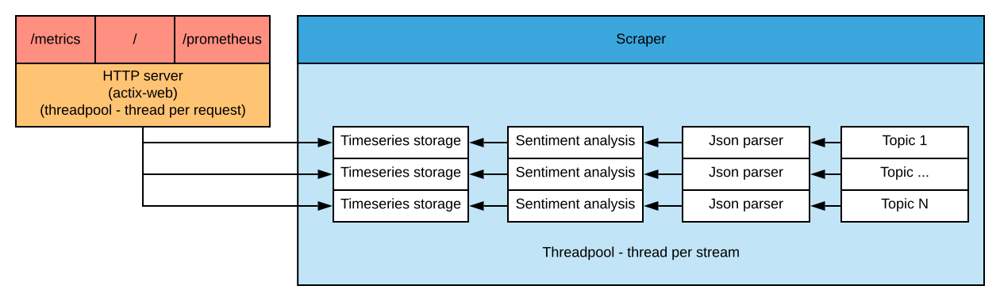

# Twitter Sibyl System

A toy project to track twitter topic sentiment over time.

https://twitter-sibyl-system.herokuapp.com/

## Endpoints

The application exposes three HTTP endpoints:

* `/`: Which shows a line chart containing the time series of sentiment values for each provided topic. The chart will auto-update every 10 seconds
* `/metrics?t_minus=<val>`: Which replies with JSON formatted time-series data for all topics
* `/prometheus`: Which exposes [Prometheus](https://prometheus.io/) formatted auxiliary statistics about the application, 
e.g tweet processing rate, timing & backlog

## Architecture



## Build & Test

The entire project can be built using the standard cargo toolchain, e.g.
```shell
> cargo build (--release) 
> cargo test
```
Please note that testing is rather limited at present.

## Configure

The application can be configured either via a TOML config file. A `full.toml` example can be found in the `/cfg` directory.
The config file can specified when starting the application using:
```shell script
> twitter-sibyl-system -c config.toml
```

Alternatively if no configuration file is specified, the application will attempt to fetch the
required options from their respective environment variables. The following list of environment variables are required:

* `PORT`: Port the HTTP server will listen on
* `CONSUMER_KEY`: Twitter API consumer key
* `CONSUMER_SECRET`: Twitter API consumer secret
* `ACCESS_KEY`: Twitter API access key
* `ACCESS_SECRET`: Twitter API access secret
* `TOPICS`: Comma separated list of topics to fetch & process new tweets for

The following values are optional:

* `HOST` -> Address the HTTP server will listen on, defaults to `0.0.0.0`
* `BATCH_SIZE` -> Tweets are processed in batches of this size, defaults to `100`

## Deploy

The service can be deployed automatically via [Heroku](https://www.heroku.com/home).

### Prerequisites

* Install the [Heroku CLI](https://devcenter.heroku.com/articles/heroku-cli#download-and-install) 
* Add Heroku remote git repository
    * `> heroku git:remote -a twitter-sibyl-system`
* Define the [Rust buildpack](https://github.com/emk/heroku-buildpack-rust)
    * `> heroku buildpacks:set emk/rust`
* Set the required environment variables, c.f.r. the [config](#configure) section
    * `> heroku config:set ACCESS_KEY=my_access_key`


```shell
> git push heroku <commit|branch|tag>
```

